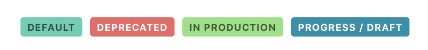

<Banner title="Version Feature">
  Support for configuration has been added in version 1.2.
</Banner>

You can configure DSK by placing a file called `dsk.yaml` in the root of
your Design Definitions Tree. This configuration file could look like this:

<CodeBlock title="dsk.yaml">

</CodeBlock>

Property | Type | Default | Description
---|---|---|---|
`org` | `String` | `DSK` | The name of the organization that this Design System is for. Will be displayed in the top left corner of the UI.
`project` | `String` | name of the DDT folder | The name of the Design System. Will be displayed in the top left corner of the UI next to the name of the organization.
`lang` | [`ISO 639-1 Code`](https://en.wikipedia.org/wiki/ISO_639-1) | `en` | Code of the language, the documents are authored in. Mainly used for indexing the documents for search.
`tags` | `[]TagConfig` | – | An array of configuration objects for specific tags. Allows you to display certain tags in custom colors.
`figma` | `FigmaConfig` | - | Configuration related to [Figma](https://www.figma.com/).

## Configuring Tags (`TagConfig`)

<figure>
  
  <figcaption>The result of the example configuration above</figcaption>
</figure>

Configuring tags allows you to define which color is used for a specific tag.

Property | Type | Default | Description
---|---|---|---|
`name` | `String` | – | The color will be used if a tag **contains** this string.
`color` | `CSS Color String` (i.e. hex, rgba) | – | The color to use for the tag.

<Banner title="Tip">
  If you want to use colors that blend in with the frontend you can also use one of the following values:
  <code>var(--color-teal)</code>, <code>var(--color-yellow)</code>,
  <code>var(--color-orange)</code>, <code>var(--color-red)</code>.
</Banner>

## Figma Access (`FigmaConfig`)

Property | Type | Default Value | Description
---|---|---|---|
`accessToken` | `Figma Personal Access Token` | – | A [generated figma personal access token](https://www.figma.com/developers/api#access-tokens), used for accessing the Figma API on your behalf.
