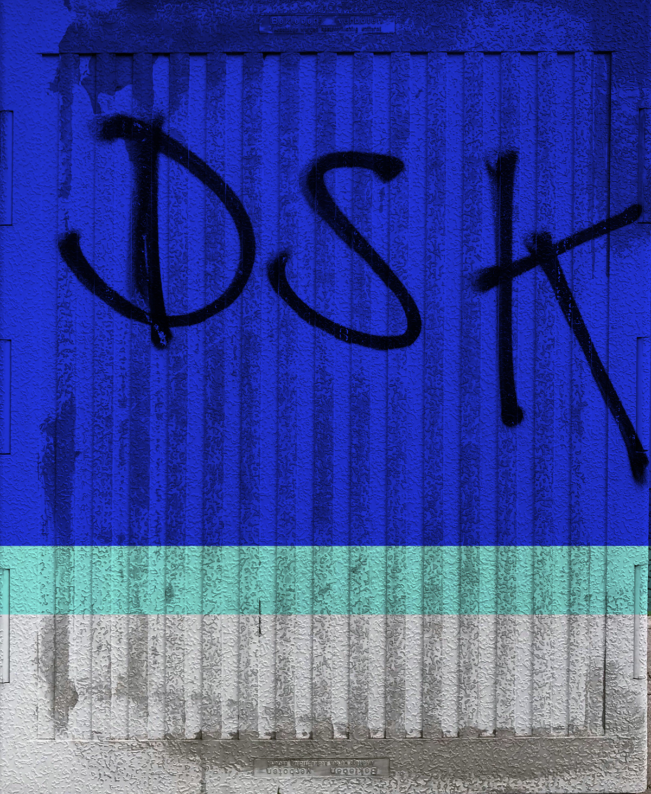

# Design System Kit 1.2 Released



This is DSK release 1.2, which brings in over 250 commits since the release
of 1.1 in November last year. It is the third stable release in the continued
version 1 series. The new version brings a new frontend, documentation
components and a new website with an expanded documentation.

## New Frontend

Yes, we’ve rebuilt the frontend from scratch, and moved it from Vanilla
JavaScript to React. While the former had its benefits, we hope the new
frontend code will make more developers feel at home. 

The new frontend surfaces important features like full text search introduced in
earlier versions and sets us up for many more improvements to come. It also comes
with a refined visual design for a cleaner and more professional look.

### Tests

We love well tested code, because we are convinced you can only move
fast and good if you don’t have to fear breaking existing code.
New features can only impress if they are solid from the beginning. 

Frontend tests became even more important, the more advanced the frontend
became and the more its complexity grew. We needed a mechanism to control that.

While we had a well tested backend, we were unfortunately held back from
adding frontend tests by the constraints of keeping JavaScript vanilly and by
self imposed limitations on accessing the ecosystem.

With React came components and [components are way easier to test](https://github.com/atelierdisko/dsk/blob/1.2/frontend/src/CodeBlock/index.test.js),
as they encapsulate logic nicely. Lifting some limitations allowed us to access
the full ecosystem and to bring in state of the art testing tools. We now look
forward to adding more tests as we go.

## Documentation Components

[Documentation components](The-Design-Definitions-Tree/Documents/Components)
are high-fidelity components for you to use in your documentation. They
are purpose-built for documenting Design Systems. 

We’re starting with a handful of essential components, as well as some advanced components
like `<FigmaEmbed>`, which shows a live frame of a Figma document, the
`<Playground>`, which comes with annotations support, or the beautiful
[`<TypographySpecimen>`](The-Design-Definitions-Tree/Documents/Components/Typography-Specimen). 
There are many more documentation components to expect in the
future.

Using documentation components is pretty intuitive! This is how you write your
Markdown and include a color card:

```
# I love colors

This one reminds me a bit of Yves Klein.

<Color color="#001dff">Blue</Color>

See?
```

Making documentation components happen meant changing how we process and parse
documents. We use, what we think are, the best Markdown and HTML parsers
for Go, but these still didn’t know about components.

One of our goal was that authors can use documentation components intuitively,
without breaking their flow of writing, or educating them to a foreign 
new syntax or use hacks like code fences.

We’ve been inspired by the way MDX embedded a second markup-language inside
Markdown. We think language embedding, aka mixing languages, will become even
more important in the future in many places.

The component syntax is deliberately kept simple and just feels like HTML.
Although it isn’t full blown JSX, like MDX does support, our syntax is powerful
enough for the use case we defined. It is parsed just-in-time and requires no precompilation.

## New Website

As you’ve possibly noticed already, you’re looking at our brand new website.
It includes general documentation, a live view into the example Design System and
introduction guides that get you started quickly.

The new website is run by DSK itself – how meta. We liked that idea, as this
also gives you a feel how DSK looks like in production.

## Credits

The core team especially likes to thank our corporate sponsors [Fielmann](https://fielmann.de)
for their continued support and our new sponsor [dpa](https://dpa.com) for
allowing us to make DSK even better.

For this release and thanks to [Michael Schieben](https://github.com/rockitbaby) and [Franca Winter](https://github.com/francawinter), who contributed the custom-key feature, you can now add custom meta data that’s important to your Design System.

Thank you for supporting Open Source Software.

## Give it a spin!

This post probably only touched the surface of changes, please see the
[changelog](https://github.com/atelierdisko/dsk/blob/v1.2.0/CHANGELOG.md)
for the complete list of things to execpt. The latest release can be downloaded from the
[releases section](https://github.com/atelierdisko/dsk/releases/tag/v1.2.0)
of our [GitHub project page](https://github.com/atelierdisko/dsk).

In case you find a bug, we’re glad to hear about it in our [issue
tracker](https://github.com/atelierdisko/dsk/issues). If you’d like
to contribute to the future development of DSK as a designer or
developer or have questions, we’ll be answering your email under
[thankyou@rundsk.com](mailto:thankyou@rundsk.com).

## Upcoming Talk

Be also sure to catch Christoph and Marius for their new talk at [the code.talks
conference](https://www.codetalks.de/) in Hamburg on 24th and 25th October. Once
we have more details we’ll be announcing the talk on the DSK website officially.
