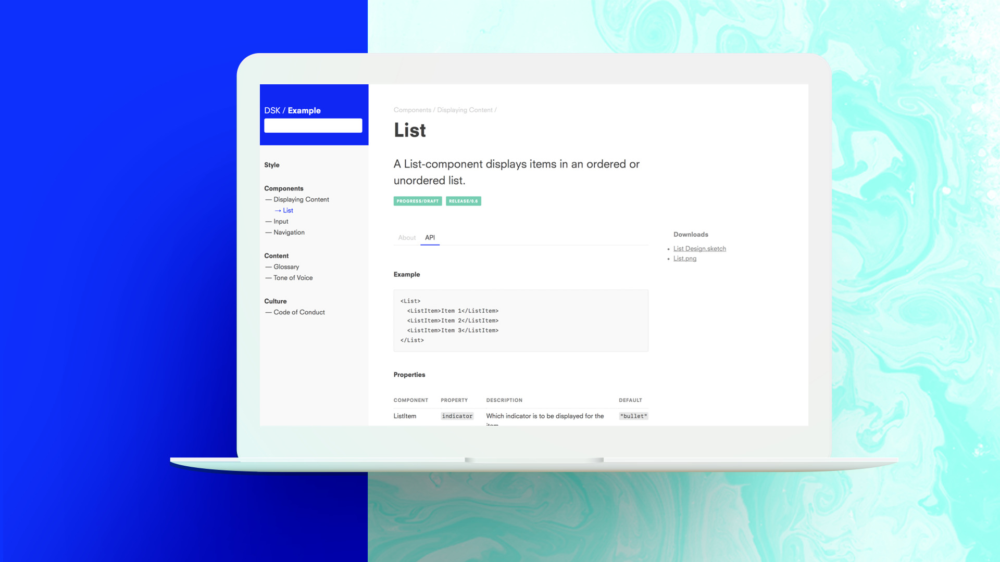

# Design System Kit

Using the Design System Kit you quickly define and organize
_design aspects_ into a browsable and live-searchable design system.
Hierarchies between design aspects are established using plain
simple directories. Creating documentation is as easy as adding a
[Markdown](https://guides.github.com/features/mastering-markdown/) formatted
file to a folder inside the _design definitions tree_.

Get started with our [Step by Step Guide](Getting-Started/Step-by-Step) 
or [download the latest DSK release](https://github.com/atelierdisko/dsk/releases/latest).

## Sponsors

 

