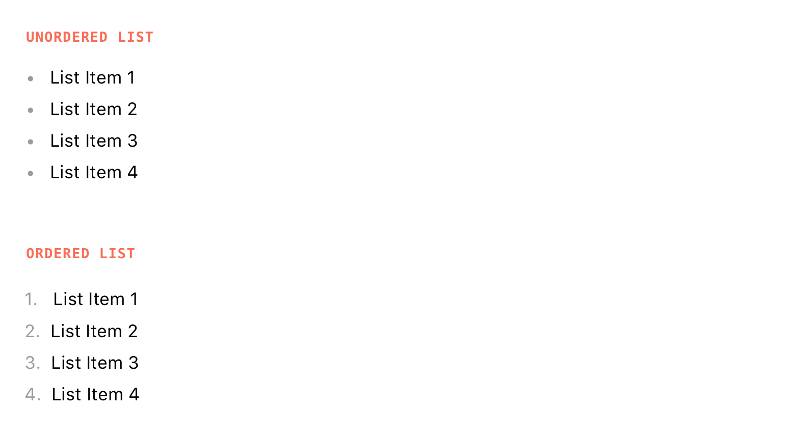

# Visual Design

The following visual design has been agreed upon by our team:

# Usage Rules

We use lists when we have to convey large amounts of information, but still keep it well structured. As they can easily grow very large, we try to keep the number of lists in our interfaces down to a minimum.

# Not to be confused with …

Whe both lists and [tables](/Components/Displaying Content/Table) display content in an orderly fashion, list are to be used for listed data, while table must only be used for tabular data. Duh.
